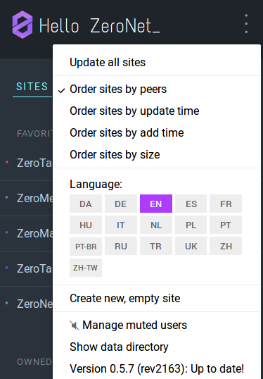

## Introduction

In ZeroNet, it is possible to add plugins. Some of the features that we already use are actually plugins which is available at download like `MergerSite` or `Ǹewsfeed`. For now, there is no plugin store available in which you can select which one you want to install but it is still quite simple to add, disable or create a plugin. In this tutorial, we will see how to write one really simple plugin and how to interact with it from a zite.

> **Note** : I advice to read [The Basics](http://127.0.0.1:43110/14pM9huTYzJdyQyHRj6v2kfhMe8DrxwpGt/?/tutorials/the_basics) tutorial first. Knowing how to create a zeronet site would also be usefull for this tutorial.


## ZeroNet Plugins

In your ZeroNet folder will find a `plugins` folder. If you have installed ZeroNet throught ZeroBundle, you might find it under the `core` folder.

You should see a bunch of folders like the following :

```
.
├── AnnounceZero
├── Cors
├── CryptMessage
├── disabled-Bootstrapper
├── disabled-Dnschain
├── disabled-DonationMessage
├── disabled-Multiuser
├── disabled-StemPort
├── disabled-UiPassword
├── disabled-Zeroname-local
├── FilePack
├── MergerSite
├── Mute
├── Newsfeed
├── OptionalManager
├── PeerDb
├── Sidebar
├── Stats
├── TranslateSite
├── Trayicon
└── Zeroname

```

We can notice that some folders name have the prefix `disabled-` it means that those plugins are not active. If you want to active them you can rename them and remove this prefix. Once ZeroNet restart those plugin will load.

It means that if you want to add a new plugin you just need to copy it in a new folder inside this `plugins` folder.

Now we can start writing our own plugin.

## Hello World ZeroNet Plugin

First, we need to create a new folder with the name of our plugin : `HelloWorld`.

```
$ mkdir HelloWorld
$ cd HelloWorld
```

We will need two python files : `__init__.py` and `HelloWorldPlugin.py`.

Lets create them :
```
$ touch __init__.py HelloWorldPlugin.py
```

In `__init__.py`, we simply need to import our plugin.

```python
import HelloWorldPlugin
```

Now we are getting to the interesting part...


Lets create an zeroframe new api that allow us to comunicate with a website by using the command `helloWorld` and it will return a json message that says `Hello World !`.

For that we need to create a `UiWebsocketPlugin` class in our `HelloWorldPlugin.py` file.

```python
from Plugin import PluginManager

@PluginManager.registerTo("UiWebsocket")
class UiWebsocketPlugin(object):

```

We see that we have a `PluginManager.registerTo("UiWebsocket")` decorator, it is what will register and load our plugin into ZeroNet and extend our class as an `UiWebsocket`.

We can now create an _action_ to communicate our message via websocket. Let's define it in our class `UiWebsocketPlugin`...

```python
from Plugin import PluginManager

@PluginManager.registerTo("UiWebsocket")
class UiWebsocketPlugin(object):

    # Create a new action that can be called using zeroframe api
    def actionHelloWorld(self, to):
        self.response(to, {'message':'Hello World'})
```

We have added a `actionHelloWorld` method to our class. We will notice here that the `action` prefix is mandatory in order to be called through the zeroframe api.

We have two important elements that we are using here :
1. **to** : represent the zite that called our comand.
2. **response(to, json)**: the method that return the response to the zite using json format through websocket.

Our plugin is done. Let's test it !

> **Note** : I am only showing here how to create a UIWebsocket plugin type there is others class that accept plugins :
- UiRequest
- User
- UserManager
- WorkerManager
- TorManager
- Site
- SiteManager
- FileRequest
- ContentDb
- ConfigPlugin
- Actions
- SiteStorage
- UIWebsocket

## Hello World zite

We are going to create a fairly simple website to test our new feature. I will not give any details on how to create a zeronet site this subject will be cover in an other tutorial and is already cover on nofish blog.



Click on create new site on ZeroHello page. You should have those files in your site folder :

```
.
├── content.json
├── index.html
└── js
    └── ZeroFrame.js

1 directory, 3 files
```

Open the `index.html` file. You should have the following lines of code :

```javascript
class Page extends ZeroFrame {
	setSiteInfo(site_info) {
		var out = document.getElementById("out")
		out.innerHTML =
			"Page address: " + site_info.address +
			"<br>- Peers: " + site_info.peers +
			"<br>- Size: " + site_info.settings.size +
			"<br>- Modified: " + (new Date(site_info.content.modified*1000))
	}

	onOpenWebsocket() {
		this.cmd("siteInfo", [], function(site_info) {
			page.setSiteInfo(site_info)
		})
	}

	onRequest(cmd, message) {
		if (cmd == "setSiteInfo")
			this.setSiteInfo(message.params)
		else
			this.log("Unknown incoming message:", cmd)
	}
}
page = new Page()
```

Lets add a new method to our `Page` class that will print our message to the page. We will call it `setHelloWorld`.

```javascript
setHelloWorld(message) {
  var out = document.getElementById("out")
  out.innerHTML = message
}
```

We are then going to modify `onOpenWebsocket` method so that instead to get the `"siteInfo"` api we want to call our `"helloWorld"` api.

```javascript
onOpenWebsocket() {
  var self = this
  this.cmd("helloWorld", [], function(response) {
    self.setHelloWorld(response.message)
  })
}
```

We then pass the message in the response to our `setHelloWorld` method so it can modify the html dom and show our message.

> **Note** : The name of our action method in our plugin will give us the name of our api. We noticed that we have removed the `action` prefix and the capital letter on the first word.

Final code :

```javascript
class Page extends ZeroFrame {
	setSiteInfo(site_info) {
		var out = document.getElementById("out")
		out.innerHTML =
			"Page address: " + site_info.address +
			"<br>- Peers: " + site_info.peers +
			"<br>- Size: " + site_info.settings.size +
			"<br>- Modified: " + (new Date(site_info.content.modified*1000))
	}


  setHelloWorld(message) {
    var out = document.getElementById("out")
    out.innerHTML = message
  }

	onOpenWebsocket() {
    var self = this
		this.cmd("helloWorld", [], function(response) {
      self.setHelloWorld(response.message)
		})
	}

	onRequest(cmd, message) {
		if (cmd == "setSiteInfo")
			this.setSiteInfo(message.params)
		else
			this.log("Unknown incoming message:", cmd)
	}
}
page = new Page()
```

There is many distributed applications to which we could plug Zeronet with. It is maybe also why ZeroNet is such a great application. Now you can also start to write your own.
